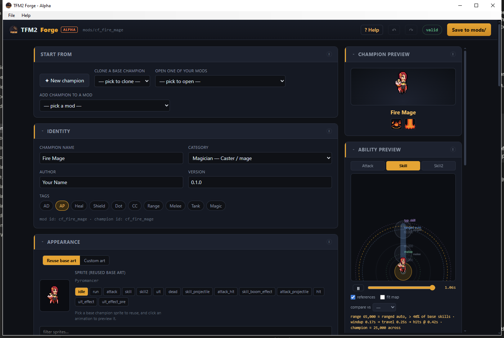
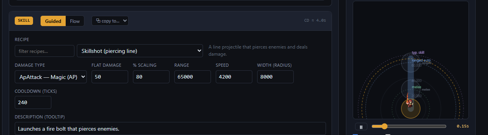
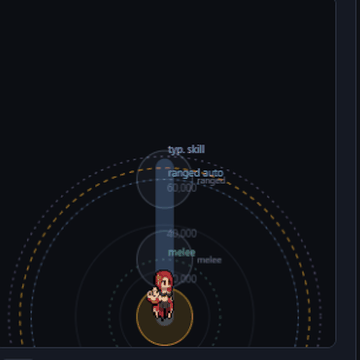
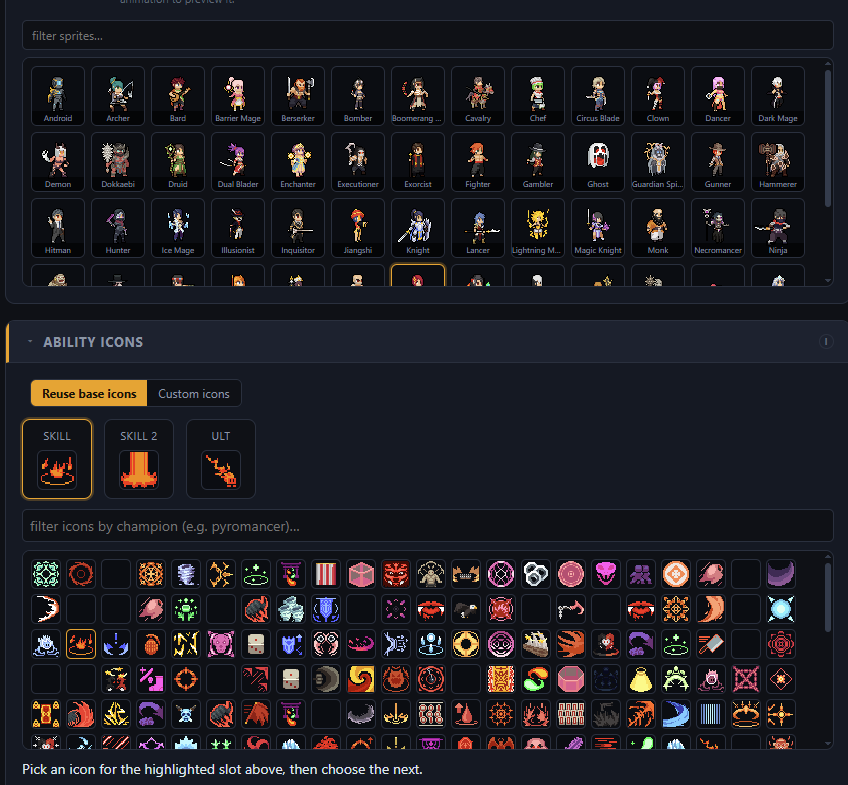
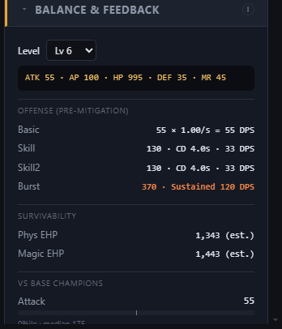

  

<h1 align="center">TFM2 Forge</h1>

  <b>Create Teamfight Manager&nbsp;2 champions visually — no code, no JSON.</b> 
  Design stats, abilities, art and sound, and TFM2 Forge writes a complete, valid mod straight into your game.

  
  &nbsp;
  &nbsp;

  

Created by <b>Zietes</b> · fan-made, not affiliated with TeamSamoyed

---

## What it does

TFM2 Forge is a full champion editor — identity and stats, up to four abilities, art, effects and sound — with live previews and validation, exported as a ready-to-play mod. No JSON or coding required.

### Build abilities from recipes — with a live preview

Pick from **36 ready-made recipes** (skillshots, dashes, AoE, hooks, shields, damage-over-time…) and tune the numbers, or drop into the advanced **Flow** node editor for full control. The Ability Preview draws range, area and timing **to scale** and animates the cast, so you can see exactly what an ability does before it hits the game.

   
   
  <i>A guided recipe and the live, to-scale Ability Preview.</i>

### Reuse your game's own art

Browse and reuse all **60 base champion sprites** and **hundreds of ability icons** from your own install — or bring custom sprites, projectiles, effects (`.aseprite` / PNG) and sounds. Nothing from the game is bundled or redistributed; it is read from your copy.

   
  <i>Every base sprite and icon, ready to reuse.</i>

### Balance as you build

See DPS, burst, sustained damage and effective HP at any level, and how your champion ranks against the 60 base champions — so balance is part of the design, not an afterthought.

   
  <i>Live stats and percentile bars versus the base roster.</i>

### And more

- Multi-champion mods in a single package
- Passives and per-ability character animations
- Cast and impact VFX & SFX
- Undo / redo with automatic draft recovery
- Live validation and one-click save into `mods/`

---

## Getting started

1. **Download and run** TFM2 Forge (installer or portable — see below). On first launch it finds your game and extracts the data it needs.
2. **Start a champion** — new, clone a base champion, or open one of your mods.
3. **Build it** — identity, art, stats and up to four abilities, watching the preview, balance and validation update on the right.
4. **Save to `mods/`**, then enable the mod in Teamfight Manager&nbsp;2 and restart the game to see your champion in the draft.

Choose **? Help** in the app at any time for the in-app guide.

---

## Download & install

| File | What it is |
|------|------------|
| **`TFM2Forge-Setup.exe`** | Installer — recommended (per-user, no admin; adds a Start-menu shortcut) |
| `TFM2Forge-Alpha.zip` | Portable — extract and run, nothing to install |

**Requirements:** Windows 10/11 and Teamfight Manager&nbsp;2 (Steam). Everything else is bundled — no Python or browser needed.

Because this is an **unsigned Alpha**, Windows SmartScreen may warn you on first run — choose **More info → Run anyway**. Each release includes a `SHA256SUMS.txt` if you'd like to verify your download.

---

## Updates

TFM2 Forge checks here for new releases on launch. When one is available, a banner offers a one-click update that downloads, installs and reopens the app for you. You can turn the check off under **? Help**.

---

## Troubleshooting

- **Champion doesn't appear in-game** — read the title-screen diagnostics popup; it names the file that failed. Make sure the mod is enabled and that you restarted the game.
- **"Game not found"** — point the tool at your `Teamfight Manager2` folder when prompted (the one containing `bundle.game_data`).
- **Back up your `mods/` folder** before big changes.

---

## Privacy

TFM2 Forge runs entirely on your machine, on a local server bound to `127.0.0.1`. It reads art and data from your own game install and does not download or redistribute any game assets. The only network request it makes is the version check described above.

---

© 2026 Zietes. All rights reserved — see <a href="LICENSE.txt">LICENSE.txt</a>. A proprietary tool distributed as compiled releases; the source is not published. Teamfight Manager&nbsp;2 and all related assets are trademarks and copyrights of TeamSamoyed.
